# **UI Usage**

## **Controls**

| Action | Function |
| ---------- | -------- |
| Press **Left** | Move up / decrease / wake device |
| Press **Right** | Move down / increase / wake device |
| Hold **Left** or **Right** | Add / confirm current pin number |
| Hold **Left + Right** | Select / confirm menu setting |
| Tap both **Left + Right** | Delete the last digit when entering a PIN |

---

## **Unlocking the Device**

When the device is locked, the display shows the PIN screen.

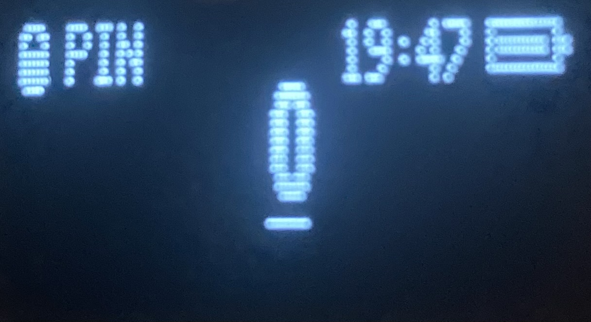

### **Entering a PIN**

1. Press **Left/Right** to change the digit.
2. Hold **Left** or **Right** to add the digit.
3. Repeat until the PIN is entered.
4. Hold **Left + Right** to submit the PIN.

5. If you make a mistake, Press **Left + Right** to remove the last entered digit.

*Note: Pin verification takes about **17 seconds**.*

---

## **TOTP Code**

After unlocking, the main screen displays the current TOTP code.

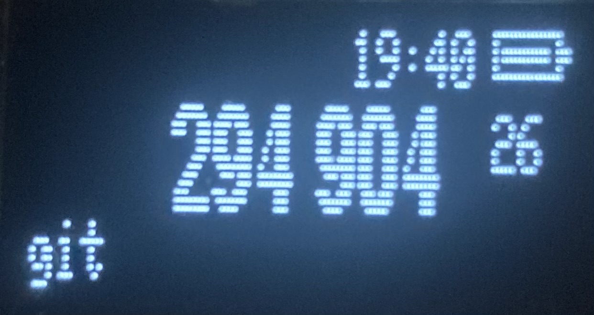

* **Left** - previous account
* **Right** - next account
* The number on the right shows the remaining seconds for the current TOTP code.

NiceTOTP automatically goes to sleep after **60 seconds of inactivity**.

---

## **Settings Menu**

From the main TOTP screen, **hold Left + Right** to open the settings menu.

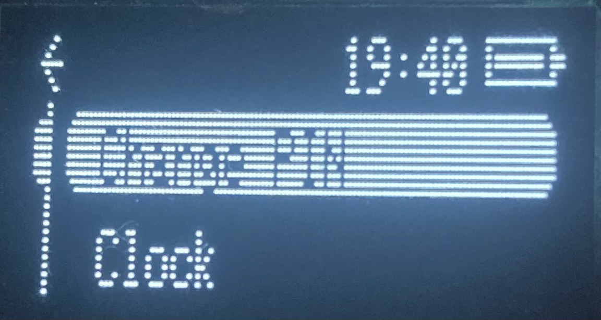

The menu as of [V14](https://github.com/ICantMakeThings/NiceTOTP/releases/tag/NiceTOTP-V014) contains:

* **Change PIN**
* **Clock**
* **Sleep**

Use **Left/Right** to move through the menu and **hold Left + Right** to select submenu.

The selected item is inverted.

---

## **Clock Settings**

Select **Clock** from the settings menu.

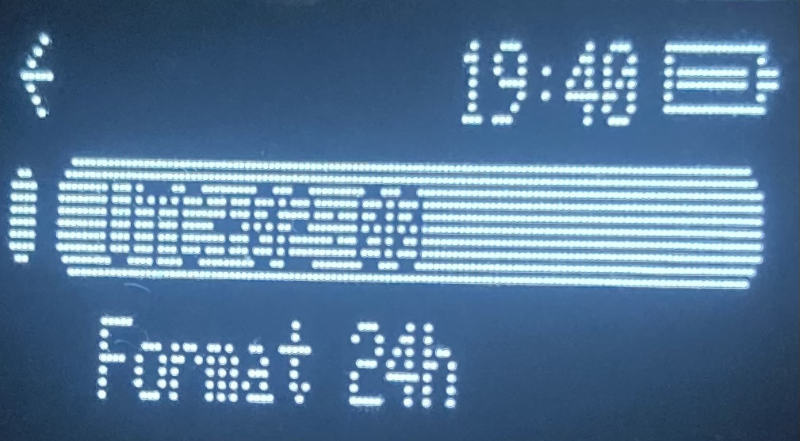

The clock settings allow you to change:

* **UTC offset** - in 30 minuite steps
* **Time format** - 24-hour or 12-hour
* **Back**

Hold **Left + Right** to save the setting.

---

## **Changing the PIN**

Select **Change PIN** from the settings menu.

### **1. Verify current PIN**

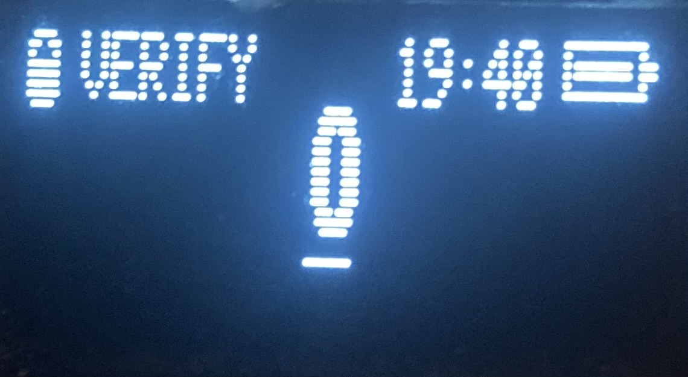

- Enter your current PIN.

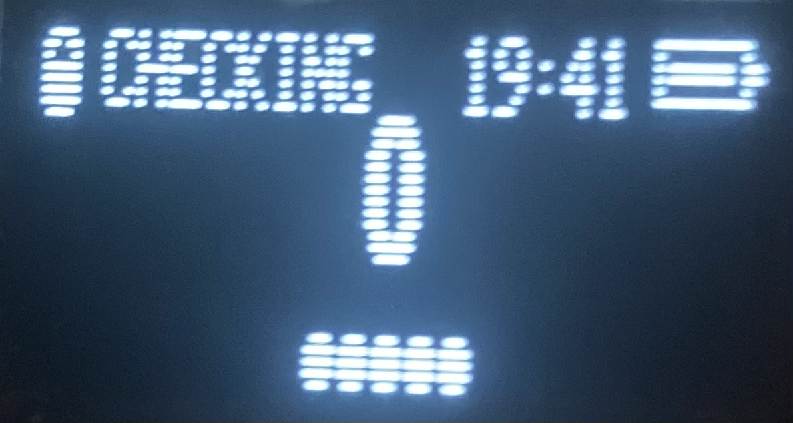

### **2. Enter the new PIN**

After the current PIN is verified, enter your new PIN.

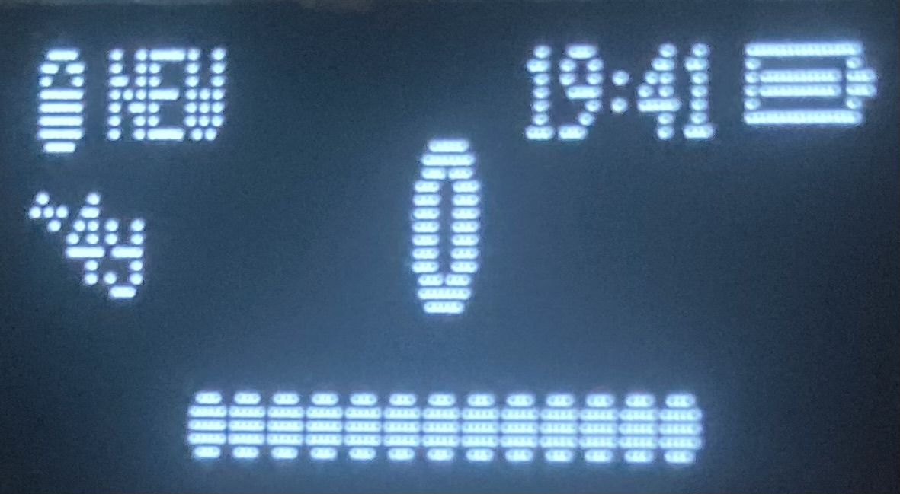

- The display shows the estimated brute-force time as the PIN gets longer.

- The algorythm is **50,000 PBKDF2** and the number is the expected value which is ½ of the worse-case scenario.
- It is based on cracking it with a NVIDIA GeForce RTX 3060 as its the most common GPU based on [Steam Hardware & Software Survey: August 2026.](https://store.steampowered.com/hwsurvey/En)
- It is recommended to have a pin of at least 13 Charicters
- You can have a look on [this webiste](https://jmrp.io/tools/pin-brute-force-calculator/) to test around different hardware, make sure PBKDF2 iterations is set to `50000`
- TOTP keys and other FS are stored in an AES-256-GCM authenticated encrypted vault, with a key derived from the passcode using PBKDF2-HMAC-SHA-256. Vaults use a random starting IV followed by monotonically increasing IVs.

A PIN must be between **4 and 20 characters**.

### **3. Confirm the new PIN**

Enter the same PIN again.

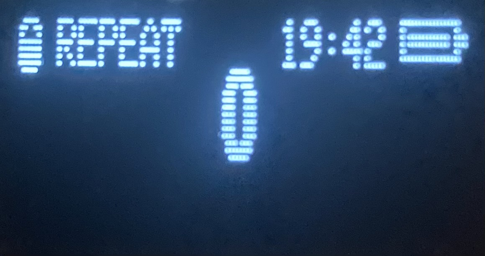

If both PIN entries match, the new PIN is saved.

---

# **App UI**

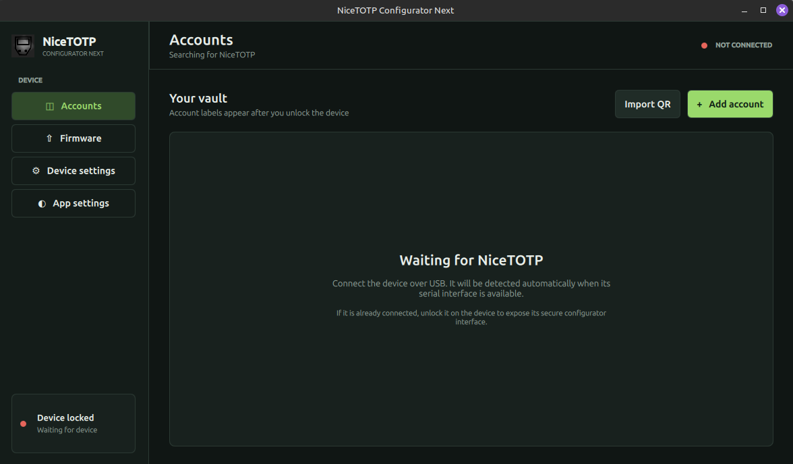

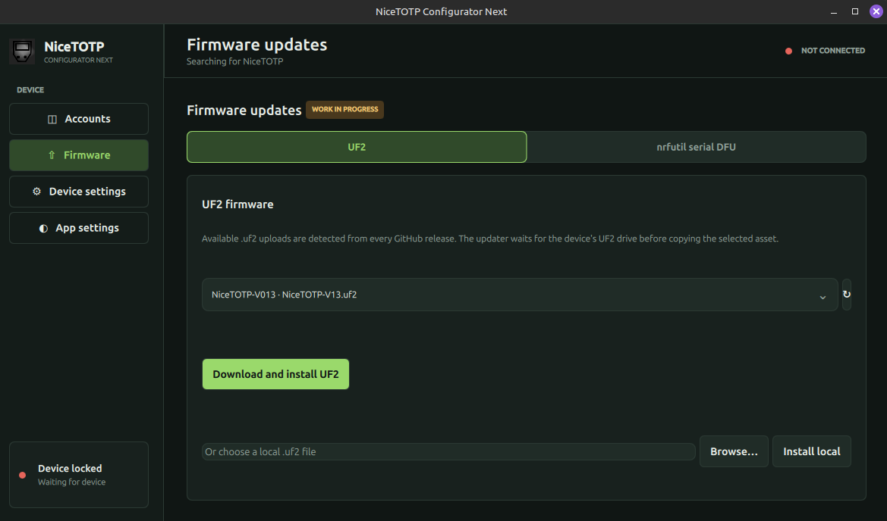

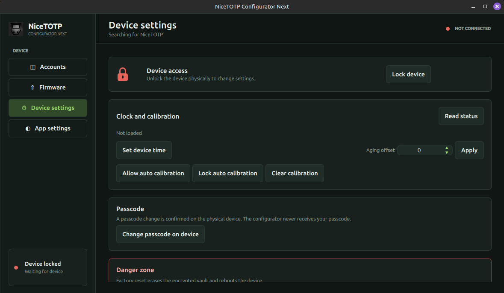

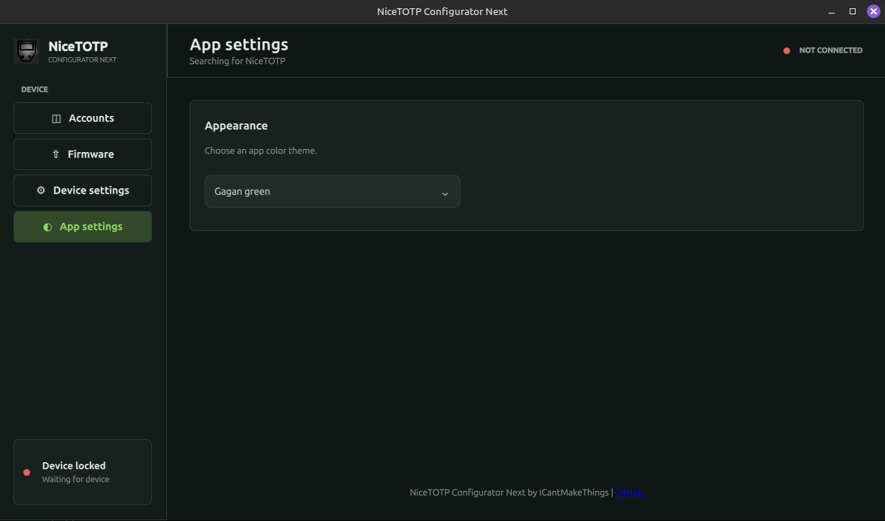

