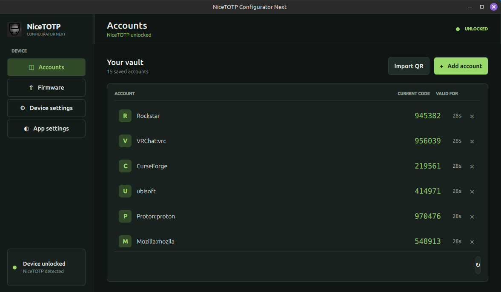
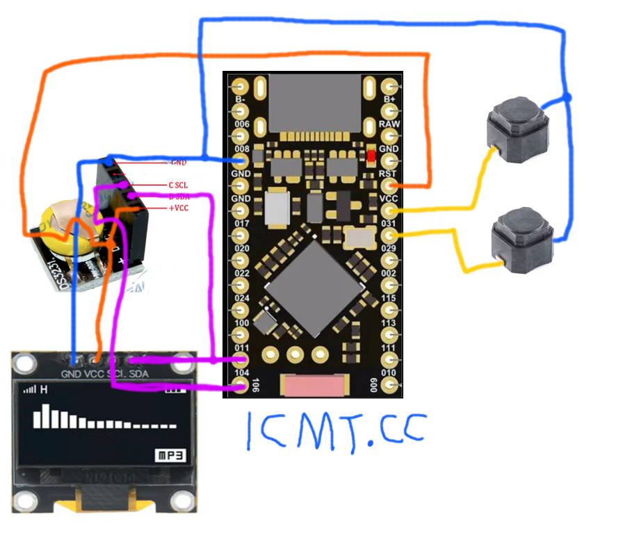

# NiceTOTP 

## Wiki

- [What is NiceTOTP?](#what-is-nicetotp)
- [But Why?](#but-why)
- [Hardware](#hardware-is)
- [Usage](#usage)
	- [UI](Docs/ui.md)
- [Installation](#installation)
	- [Standard installation](#standard-installation)
	- [Protected installation](#protected-installation)
- [More Info](#more-info)
- [Build protected from source](Docs/build-protected-from-source.md)

# What is NiceTOTP?

Time-based one-time password (TOTP). aka: 2FA! 
A alternetive to [Authy](https://www.authy.com/) / [Google Authenticator](https://play.google.com/store/apps/details?id=com.google.android.apps.authenticator2). 

Full offline, Air Gapped. And Standalone once all Keys have been added.

TOTP keys and other FS are stored in an AES-256-GCM encrypted vault, with a key derived from the passcode using PBKDF2-HMAC-SHA-256. Vaults use a random starting IV followed by monotonically increasing IVs.

A four-digit passcode is still vulnerable to offline guessing if an attacker extracts the flash. Use a longer, unpredictable numeric passcode; a lengt of 13 can make a attacker wait up to 8 years on the most common GPU* 

[Video here](https://www.youtube.com/watch?v=sLiadPXk7rc)

## But Why?? 

There are a few reasons why I made this device, mainly to lose dependence of my phone. But not just, What if your phone breaks, bricks, or something else? I rather have lots of devices that don't depend on eachother rather than a all in one for that reason, plus most "universal" stuff performs worse than a specific device for that single function. As of right now, I'd say it's almost complete (enough to daily drive), possibly a few more hardware security features, maybe UI polishing, fixing any bugs i haven't found yet and should be perfect. The cost is ~£6 excluding 3D printing.

## Hardware is:
+ Nice!Nano: [AliExpress Link](https://s.click.aliexpress.com/e/_omlmCuu)
+ DS3231 RTC: [AliExpress Link](https://s.click.aliexpress.com/e/_omVV4ia)
+ 0.96Inch Display: [AliExpress Link](https://s.click.aliexpress.com/e/_ooXwYgq)
+ 6*6 Silicone Switch: [AliExpress Link](https://s.click.aliexpress.com/e/_oDcs8Wa)
+ 3D [model](https://www.thingiverse.com/thing:7087241)

*Note: These are referral links. If you purchase through it, I earn a commission at no extra cost to you.*

# Usage
#### Use the [NiceTOTP-ConfiguratorNext](https://github.com/ICantMakeThings/NiceTOTP/releases)  (Firmware update doesnt work rn*)
#### or you can use serial commands:
- `setunixtime` example: `setunixtime 1751925355` 
- The first `setunixtime` stores the real time for future auto-calibration which after 30 days it will compensate for any drift in the DS3231.
- `manualcalibration <offset>` example: `manualcalibration 3` sets the DS3231 aging register from -128 to 127 and locks automatic calibration
- `lockcalibration` stops auto-calibration
- `unlockcalibration` turns back on auto-calibration
- `getcalibration` reports the aging offset, baseline timestamp, and lock state
- `clearcalibration` clears the aging correction and removes the stored calibration baseline
- `add <username> <base32secret>` example: `add test JBSWY3DPEHPK3PXP` ([Compare](https://totp.danhersam.com/?secret=JBSWY3DPEHPK3PXP))
- `list`
- `del <GetTheIDFromListCommand>` example: `del 1`
- `factoryreset` (Power cycle after)

# Installation

### Standard installation

If you don't care about proper security*, download the [NiceTOTP-ConfiguratorNext](https://github.com/ICantMakeThings/NiceTOTP/releases) and use the unsigned `NiceTOTP-V1x.uf2` firmware.

**Or if you just want to test the device without commiting to the protected bootloader / hassle with setting it up or not owning a ST-Link*

+ Or Drag and drop the .UF2 onto the nicenano drive when doubble clicking reset (short rst pin with usbc sheild tapping twice quickly)

### Protected installation
- Download `Signed.zip` from latest release, and follow
[Protected installation](Docs/build-protected-from-source.md) (Also includes installing from source)

# More Info

+ In 2 months the RTC drifted 8s forward. (Now there is a calibration feature, so should be better, to be commented on further.)

+ Battery seems to last about 1 year with a 1000mAh Battery.

+ Make sure not to let it discharge as it will go in a soft brick, to unbrick you just press rst 

#### GPU* 

- The algorythm is **50,000 PBKDF2** and the number is the expected value which is ½ of the worse-case scenario.
- It is based on cracking it with a NVIDIA GeForce RTX 3060 as its the most common GPU based on [Steam Hardware & Software Survey: August 2026.](https://store.steampowered.com/hwsurvey/En)
- It is recommended to have a pin of at least 13 Charicters
- You can have a look on [this webiste](https://jmrp.io/tools/pin-brute-force-calculator/) to test around different hardware, make sure PBKDF2 iterations is set to `50000`